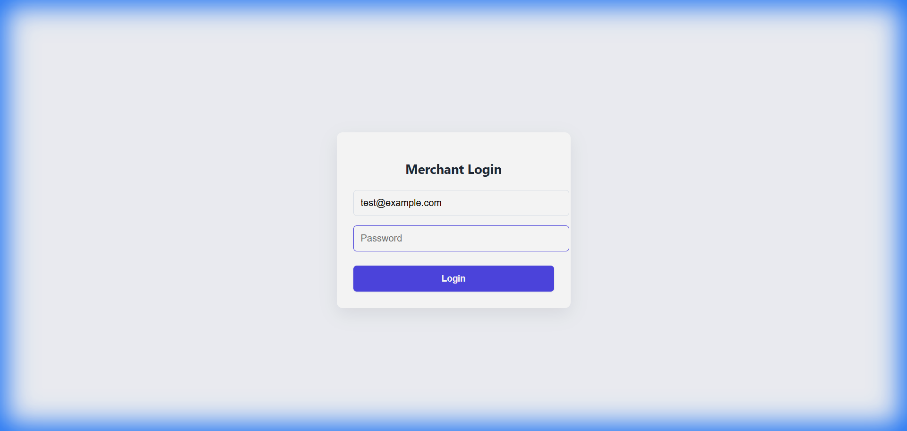
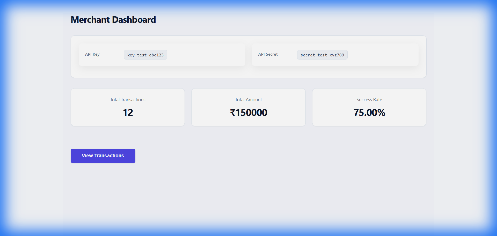
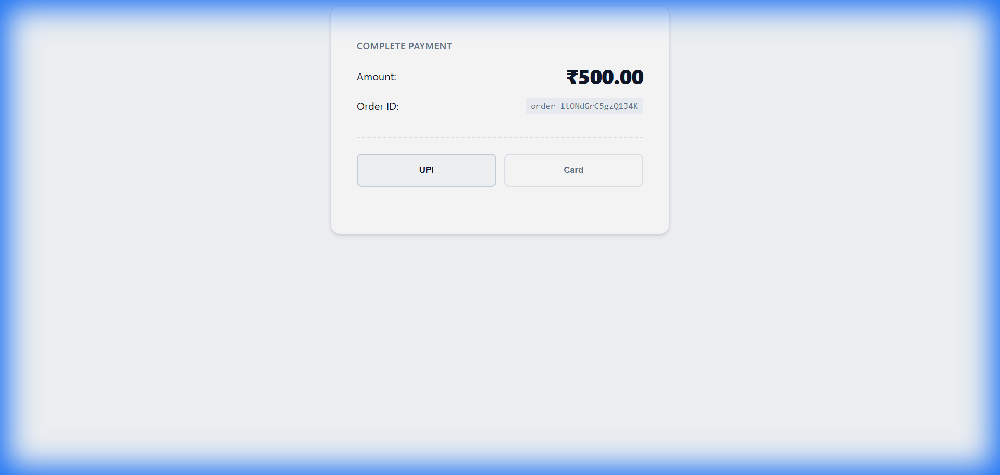
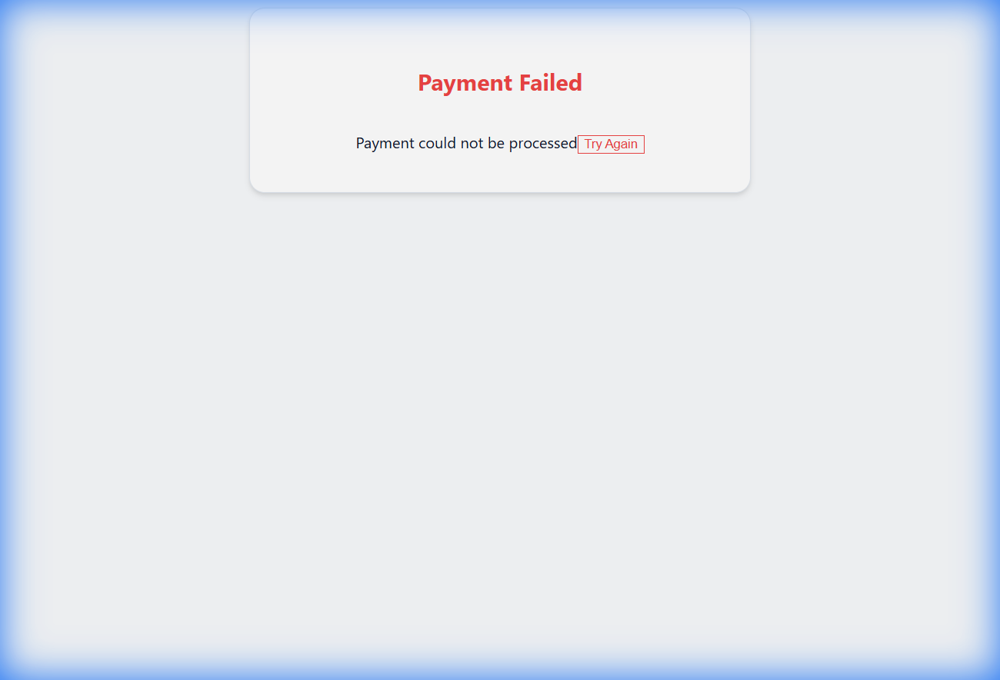

# Payment Gateway with Multi-Method Processing & Hosted Checkout

This project implements a Dockerized payment gateway similar to Razorpay/Stripe, supporting merchant onboarding, order creation, UPI & card payments, and a hosted checkout page.
It demonstrates backend API development, payment validation logic, state machine handling, and frontend checkout integration.

## Features

- **Merchant authentication** using API Key & Secret
- **Order creation and retrieval APIs**
- **Payment processing** with:
  - UPI (VPA validation)
  - Card payments (Luhn algorithm, network detection, expiry validation)
- **Hosted checkout page** for customers
- **Deterministic test mode** for evaluation
- **Fully containerized** using Docker Compose
- **PostgreSQL database** with automatic seeding
- **Redis & worker integration** (health-checked)

---

## System Architecture

### Components:
- **Backend API (Node.js + Express)** – Handles orders, payments, authentication
- **PostgreSQL** – Persists merchants, orders, and payments
- **Redis + Worker** – Background job readiness & health checks
- **Dashboard Frontend (Nginx)** – Merchant dashboard
- **Checkout Page (Nginx)** – Hosted payment UI

Architecture diagram is included in the `/docs` folder.


---

## Dockerized Setup

### Prerequisites
- Docker
- Docker Compose

### Start the application

```bash
docker-compose up -d --build
```
All services start with one command. No manual setup required.

### Service Ports

| Service | URL |
|---------|-----|
| **API** | http://localhost:8000 |
| **Dashboard** | http://localhost:3000 |
| **Checkout Page** | http://localhost:3001 |

### Test Merchant (Auto-Seeded)
The application automatically seeds a test merchant on startup:

- **Email**: `test@example.com`
- **API Key**: `key_test_abc123`
- **API Secret**: `secret_test_xyz789`

*No manual merchant creation required.*

---

## Environment Configuration

An example environment file is provided:
- `.env.example`

This documents all required environment variables used by the system.

---

## API Documentation

### Health Check
**GET** `/health`
```json
{
  "status": "healthy",
  "database": "connected",
  "redis": "connected",
  "worker": "running",
  "timestamp": "2026-01-10T12:30:00.000Z"
}
```

### Create Order
**POST** `/api/v1/orders`

**Headers:**
- `X-Api-Key`: key_test_abc123
- `X-Api-Secret`: secret_test_xyz789

**Body:**
```json
{
  "amount": 50000,
  "currency": "INR",
  "receipt": "receipt_123",
  "notes": {
    "customer_name": "John Doe"
  }
}
```

### Create Payment
**POST** `/api/v1/payments`

#### UPI Example
```json
{
  "order_id": "order_xxxxxxxxxxxxxxxx",
  "method": "upi",
  "vpa": "user@paytm"
}
```

#### Card Example
```json
{
  "order_id": "order_xxxxxxxxxxxxxxxx",
  "method": "card",
  "card": {
    "number": "4111111111111111",
    "expiry_month": "12",
    "expiry_year": "2026",
    "cvv": "123",
    "holder_name": "John Doe"
  }
}
```

---

## Hosted Checkout Flow

**Checkout URL format:**
`http://localhost:3001/checkout?order_id=<ORDER_ID>`

**Flow:**
1. Order details fetched using public API
2. User selects payment method (UPI/Card)
3. Payment is processed
4. UI shows processing, then success/failure

All required `data-test-id` attributes are implemented for automated evaluation.

---

## Database Schema Overview

**Tables:**
- `merchants`
- `orders`
- `payments`

**Relationships:**
- One merchant → many orders
- One order → many payments

Detailed schema documentation is available in `/docs/schema.md`.

---

## Test Mode (Evaluation Support)

The system supports deterministic testing using environment variables:

```bash
TEST_MODE=true
TEST_PAYMENT_SUCCESS=true
TEST_PROCESSING_DELAY=1000
```

This ensures predictable outcomes for automated evaluation.

---

## Screenshots & Demo

Screenshots of dashboard and checkout flow are available in `/docs`.

### 📸 Screenshots

| Merchant Login | Merchant Dashboard |
| :---: | :---: |
|  |  |

| Payment Flow | Payment Success |
| :---: | :---: |
|  |  |

---

Demo Video: ( https://www.youtube.com/watch?v=926VIW9ltqg )

## Submission Checklist

- [x] Dockerized deployment (`docker-compose up -d`)
- [x] Test merchant auto-seeded
- [x] All APIs implemented with correct formats
- [x] Hosted checkout page completed
- [x] Payment validation logic implemented
- [x] `.env.example` included
- [x] Documentation completed
